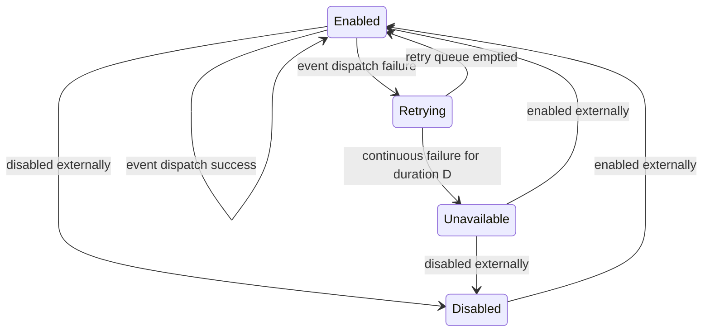

[//]: # (This file was autogenerated using `zio-sbt-website` plugin via `sbt generateReadme` command.)
[//]: # (So please do not edit it manually. Instead, change "docs/index.md" file or sbt setting keys)
[//]: # (e.g. "readmeDocumentation" and "readmeSupport".)

# ZIO Webhooks

ZIO Webhooks is a microlibrary for reliable and persistent webhook delivery.

Below is a state diagram for each webhook handled by a server. Note that there
aren't any initial or final states as the server doesn't manage the entire
lifecycle of webhooks and events—only the subset needed for reliable webhook
delivery.

[](https://mermaid-js.github.io/mermaid-live-editor/#/edit/eyJjb2RlIjoic3RhdGVEaWFncmFtLXYyXG4gICAgRW5hYmxlZCAtLT4gRGlzYWJsZWQgOiBkaXNhYmxlZCBleHRlcm5hbGx5XG4gICAgRW5hYmxlZCAtLT4gRW5hYmxlZCA6IGV2ZW50IGRpc3BhdGNoIHN1Y2Nlc3NcbiAgICBEaXNhYmxlZCAtLT4gRW5hYmxlZCA6IGVuYWJsZWQgZXh0ZXJuYWxseVxuICAgIEVuYWJsZWQgLS0-IFJldHJ5aW5nIDogZXZlbnQgZGlzcGF0Y2ggZmFpbHVyZVxuICAgIFJldHJ5aW5nIC0tPiBFbmFibGVkIDogcmV0cnkgcXVldWUgZW1wdGllZFxuICAgIFJldHJ5aW5nIC0tPiBVbmF2YWlsYWJsZSA6IGNvbnRpbnVvdXMgZmFpbHVyZSBmb3IgZHVyYXRpb24gRFxuICAgIFVuYXZhaWxhYmxlIC0tPiBFbmFibGVkIDogZW5hYmxlZCBleHRlcm5hbGx5XG4gICAgVW5hdmFpbGFibGUgLS0-IERpc2FibGVkIDogZGlzYWJsZWQgZXh0ZXJuYWxseSIsIm1lcm1haWQiOnt9LCJ1cGRhdGVFZGl0b3IiOmZhbHNlfQ)

 
## Installation

Include ZIO Webhooks in your project by adding the following to your `build.sbt`:

```scala
libraryDependencies += "dev.zio" %% "zio-webhooks" % "0.2.1"
```

## Documentation

Learn more on the [ZIO Webhooks homepage](https://zio.dev/zio-webhooks/)!

## Contributing

For the general guidelines, see ZIO [contributor's guide](https://zio.dev/about/contributing).

## Code of Conduct

See the [Code of Conduct](https://zio.dev/about/code-of-conduct)

## Support

Come chat with us on [![Badge-Discord]][Link-Discord].

[Badge-Discord]: https://img.shields.io/discord/629491597070827530?logo=discord "chat on discord"
[Link-Discord]: https://discord.gg/2ccFBr4 "Discord"

## License

[License](LICENSE)
