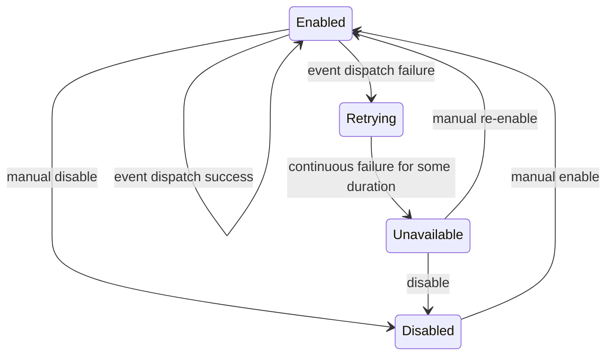

A microlibrary for reliable and persistent webhook delivery.

Lorem ipsum.

State diagram for each webhook handled by a server:

[](https://mermaid-js.github.io/mermaid-live-editor/#/edit/eyJjb2RlIjoic3RhdGVEaWFncmFtLXYyXG4gICAgRW5hYmxlZCAtLT4gRGlzYWJsZWQgOiBtYW51YWwgZGlzYWJsZVxuICAgIEVuYWJsZWQgLS0-IEVuYWJsZWQgOiBldmVudCBkaXNwYXRjaCBzdWNjZXNzXG4gICAgRGlzYWJsZWQgLS0-IEVuYWJsZWQgOiBtYW51YWwgZW5hYmxlXG4gICAgRW5hYmxlZCAtLT4gUmV0cnlpbmcgOiBldmVudCBkaXNwYXRjaCBmYWlsdXJlXG4gICAgUmV0cnlpbmcgLS0-IFVuYXZhaWxhYmxlIDogY29udGludW91cyBmYWlsdXJlIGZvciBzb21lIGR1cmF0aW9uXG4gICAgVW5hdmFpbGFibGUgLS0-IEVuYWJsZWQgOiBtYW51YWwgcmUtZW5hYmxlXG4gICAgVW5hdmFpbGFibGUgLS0-IERpc2FibGVkIDogZGlzYWJsZSIsIm1lcm1haWQiOnt9LCJ1cGRhdGVFZGl0b3IiOmZhbHNlfQ)
