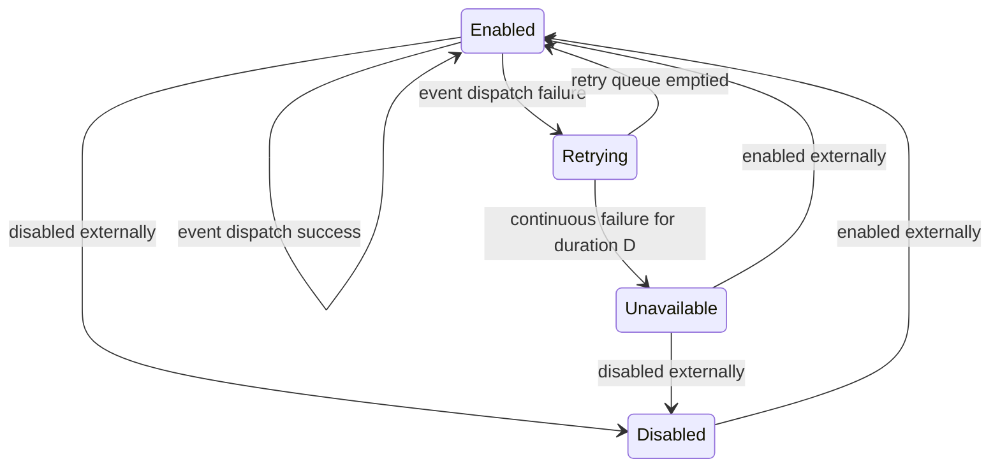

ZIO Webhooks is a microlibrary for reliable and persistent webhook delivery.

@PROJECT_BADGES@

## Introduction

Below is a state diagram for each webhook handled by a server. Note that there aren't any initial or final states as the server doesn't manage the entire lifecycle of webhooks and events—only the subset needed for reliable webhook delivery.

## Installation

Include ZIO Webhooks in your project by adding the following to your `build.sbt`:

```scala
libraryDependencies += "dev.zio" %% "zio-webhooks" % "@VERSION@"
```

# Getting Started

There are two ways to start a webhook server: as part of the managed construction of its live layer
`WebhookServer.live`, or manually by calling `WebhookServer.start`. See [examples](#example-programs) for a list of code
examples. The managed approach is recommended as it guarantees the server shuts down gracefully. Make sure to
call `shutdown` on a server created manually. Either way, users will have to implement the following dependencies that are part of `WebhookServer`'s environment:

* [`WebhookRepo`](/webhooks/src/main/scala/zio/webhooks/WebhookRepo.scala) - to get webhooks and update webhook status;
* [`WebhookEventRepo`](/webhooks/src/main/scala/zio/webhooks/WebhookEventRepo.scala) - to subscribe to events and
  update event status;
* [`WebhookHttpClient`](/webhooks/src/main/scala/zio/webhooks/WebhookHttpClient.scala) - to deliver events via HTTP POST
  ([WebhookSttpClient](/webhooks/src/main/scala/zio/webhooks/backends/sttp/WebhookSttpClient.scala) is provided and ready to use);
* [`WebhookServerConfig`](/webhooks/src/main/scala/zio/webhooks/WebhookServerConfig.scala) - to specify settings for
  error hub capacity, retrying, and batching; and
* `SerializePayload` - for specifying custom serialization of single and batched event payloads of some content type.

[](https://mermaid-js.github.io/mermaid-live-editor/#/edit/eyJjb2RlIjoic3RhdGVEaWFncmFtLXYyXG4gICAgRW5hYmxlZCAtLT4gRGlzYWJsZWQgOiBkaXNhYmxlZCBleHRlcm5hbGx5XG4gICAgRW5hYmxlZCAtLT4gRW5hYmxlZCA6IGV2ZW50IGRpc3BhdGNoIHN1Y2Nlc3NcbiAgICBEaXNhYmxlZCAtLT4gRW5hYmxlZCA6IGVuYWJsZWQgZXh0ZXJuYWxseVxuICAgIEVuYWJsZWQgLS0-IFJldHJ5aW5nIDogZXZlbnQgZGlzcGF0Y2ggZmFpbHVyZVxuICAgIFJldHJ5aW5nIC0tPiBFbmFibGVkIDogcmV0cnkgcXVldWUgZW1wdGllZFxuICAgIFJldHJ5aW5nIC0tPiBVbmF2YWlsYWJsZSA6IGNvbnRpbnVvdXMgZmFpbHVyZSBmb3IgZHVyYXRpb24gRFxuICAgIFVuYXZhaWxhYmxlIC0tPiBFbmFibGVkIDogZW5hYmxlZCBleHRlcm5hbGx5XG4gICAgVW5hdmFpbGFibGUgLS0-IERpc2FibGVkIDogZGlzYWJsZWQgZXh0ZXJuYWxseSIsIm1lcm1haWQiOnt9LCJ1cGRhdGVFZGl0b3IiOmZhbHNlfQ)

 
# Example Programs

* [Basic example](/examples/src/main/scala/zio/webhooks/example/BasicExample.scala) - most basic usage with the default configuration.
* [Basic example with batching](/examples/src/main/scala/zio/webhooks/example/BasicExampleWithBatching.scala) - same as the basic example but with batching enabled.
* [Basic example with retrying](/examples/src/main/scala/zio/webhooks/example/BasicExampleWithRetrying.scala) - shows how the server retries when an endpoint fails sometimes.
* [Custom config example](/examples/src/main/scala/zio/webhooks/example/CustomConfigExample.scala) - a custom configuration example that also showcases batched retries.
* [Event recovery example](/examples/src/main/scala/zio/webhooks/example/EventRecoveryExample.scala) - shows how the server continues retries after being restarted.
* [Manual server example](/examples/src/main/scala/zio/webhooks/example/ManualServerExample.scala) - shows how to create, start, and shut down a server programmatically.
* [Shutdown on first error](/examples/src/main/scala/zio/webhooks/example/ShutdownOnFirstError.scala) - shows how to shut down the server on the first error encountered.
